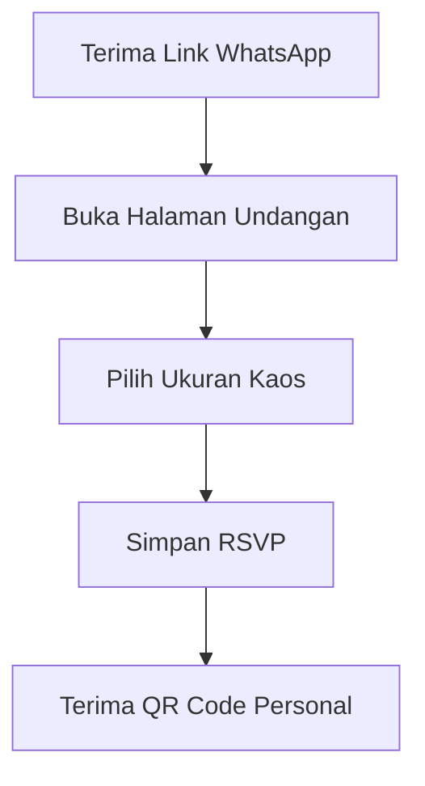
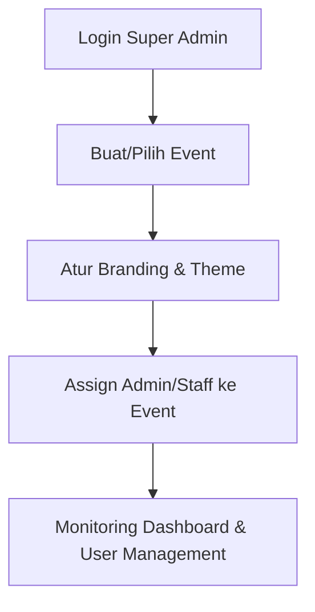
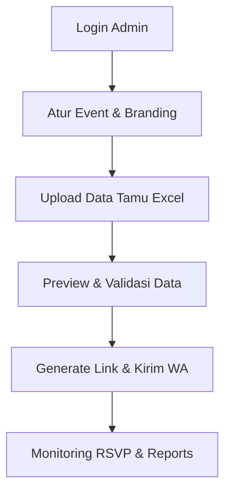
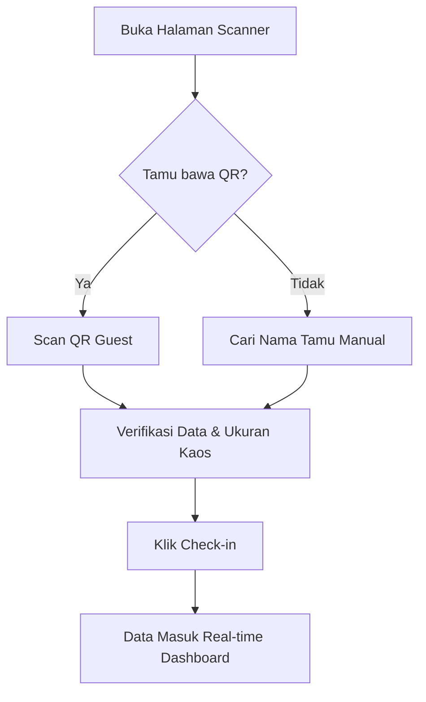
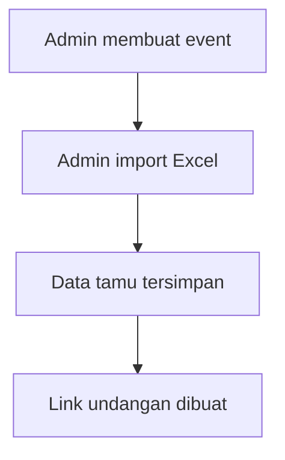
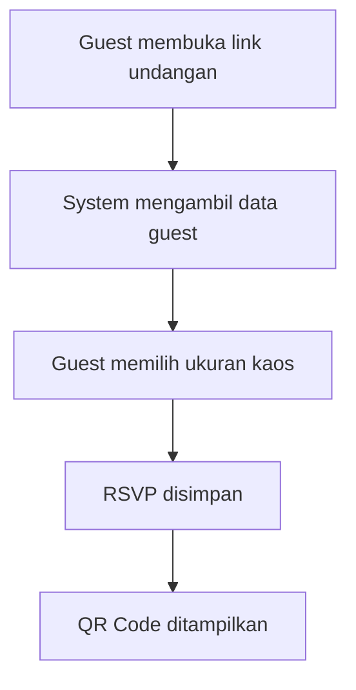
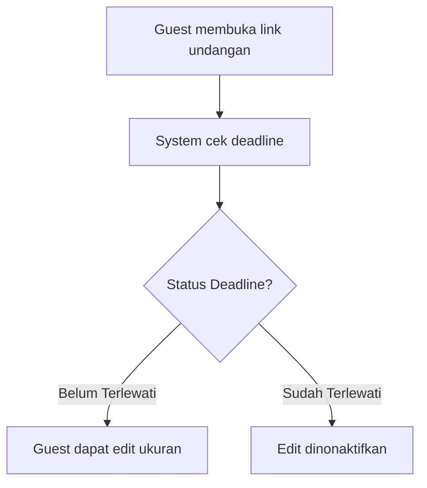
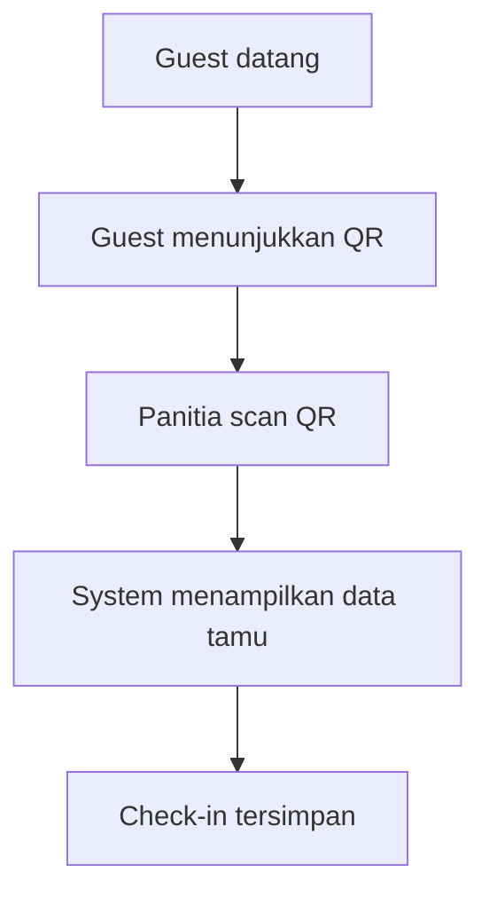
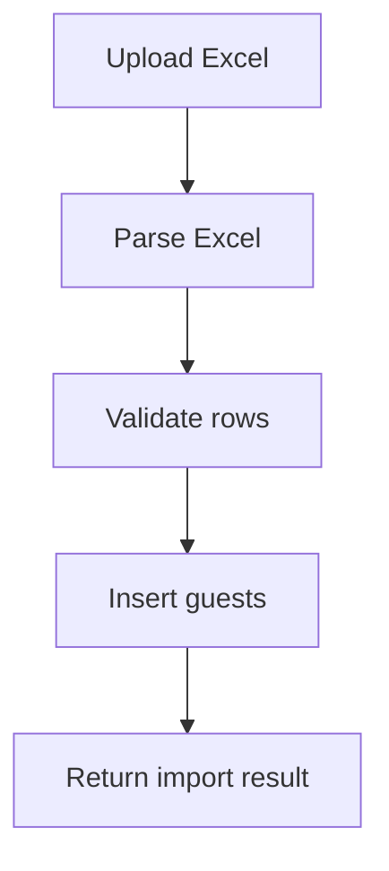
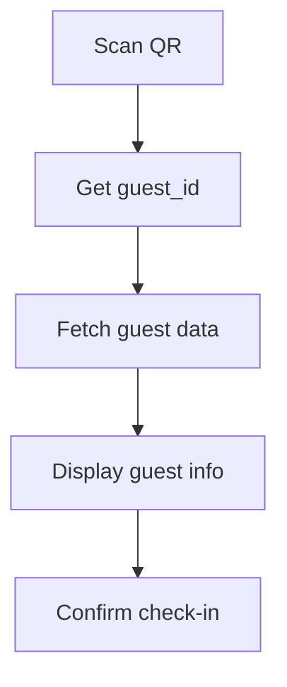

# Event Invitation & QR Check-in System

## Project Brief

---

# 1. Project Overview

Event Invitation & QR Check-in System adalah aplikasi web yang digunakan untuk mengelola undangan event perusahaan seperti **Halal Bi Halal, Gathering, Seminar, atau Townhall**.

Sistem ini memungkinkan panitia untuk:

- Mengimpor daftar tamu dari Excel
- Mengirim link undangan digital
- Mengumpulkan RSVP dan ukuran kaos
- Menghasilkan QR Code untuk check-in
- Mempercepat proses registrasi saat event
- Melihat laporan kehadiran dan rekap ukuran kaos

Sistem dirancang agar:

- **mendukung tamu karyawan dan tamu eksternal**
- **dapat digunakan untuk banyak event (multi-event)**

---

# 2. Objectives

Tujuan utama sistem ini adalah:

1. Mengelola undangan event secara digital
2. Mengumpulkan data RSVP dan ukuran kaos sebelum event
3. Mempercepat proses check-in saat event
4. Mengurangi antrian registrasi
5. Menyediakan data kehadiran secara realtime
6. Menyediakan laporan ukuran kaos untuk produksi

---

# 3. Scope

## 3.1 In Scope

Fitur yang termasuk dalam sistem:

- Import daftar tamu dari Excel
- Digital invitation
- RSVP (pilih ukuran kaos)
- Edit ukuran kaos hingga H-1 event
- QR Code invitation
- QR Scanner untuk check-in
- Dashboard daftar tamu
- Rekap ukuran kaos
- Rekap kehadiran

## 3.2 Out of Scope

Fitur berikut tidak termasuk dalam versi awal:

- Email invitation
- WhatsApp automation
- Seat assignment
- Payment/ticketing
- Authentication untuk tamu

---

# 4. User Roles

## 4.1 Guest (Tamu)

Tamu undangan yang menerima link invitation unik. Tidak memerlukan login.

**Hak akses:**

- Membuka halaman undangan (via UUID).
- Memilih ukuran kaos (jika event mewajibkan).
- Melihat QR Code personal.
- Mengedit ukuran kaos sebelum deadline.

**Workflow:**



## 4.2 Super Admin

Pemilik sistem dengan otoritas penuh. Super Admin memiliki seluruh kemampuan **Admin**, ditambah otoritas manajemen sistem.

**Hak akses:**

- Melakukan **semua** fungsi operasional Admin.
- **User Management**: Membuat, mengedit, dan mengelola akun Admin/Staff lain (Assign role).
- **Event Lifecycle**: Membuat, mengedit, dan menghapus Event.
- **Global Branding**: Mengatur Branding & Tema global yang menjadi preset.

**Workflow:**



## 4.3 Admin / Panitia (Event Manager)

Pengelola operasional event. Memiliki akses penuh terhadap fitur sistem untuk mengelola event, **kecuali** fitur manajemen pengguna/staff.

**Hak akses:**

- **Full Event Control**: Membuat, mengedit, dan mengelola detil Event serta Branding/Tema.
- **Guest Operations**: Import daftar tamu (Excel), Edit, dan Delete data tamu.
- **Invitation Management**: Mengelola pengiriman undangan (link/WhatsApp).
- **Analytics & Report**: Melihat Dashboard, Real-time Analytics, dan Export data (CSV/Excel).
- **Note**: Memiliki semua kemampuan operasional seperti Super Admin, namun dilarang mengakses User Management (tidak bisa membuat/mengatur akun Admin dan Staff lain).

**Workflow:**



## 4.4 Staff Scanner (Registration Staff)

Petugas di meja registrasi (venue).

**Hak akses:**

- Membuka halaman Scanner.
- Melakukan Scan QR & Manual Check-in.
- Melihat daftar tamu (Read-only).
- *Dilarang* mengubah setting branding atau menghapus data tamu.

**Workflow:**



---

# 5. Key Features

### WhatsApp Invitation Service (NotifAPI)

Sistem dapat mengirimkan pesan WhatsApp otomatis berisi link undangan personal.

- **Provider**: WhatsApp NotifAPI.
- **Customizable**: Admin dapat mengatur isi pesan per event.
- **Dynamic Tags**: Mendukung tag otomatis seperti `{name}` untuk sapaan tamu dan `{link}` untuk link undangan.
- **Trigger**: Cron job atau Button Click manual.

---

## 5.1 Event Management

Admin dapat membuat event baru.

Data event:

- nama event
- tanggal & jam event
- lokasi event
- Deskripsi / Sambutan
- Dress Code
- logo event
- Custom WhatsApp Template (Support dynamic tags: `{name}`, `{link}`, `{event_name}`, `{location}`)
- requirement (pakai kaos atau tidak)
- deadline edit ukuran kaos (jika pakai kaos)

---

## 5.2 Guest Import (Excel) with Preview

Admin dapat mengimport daftar tamu melalui file Excel dengan tahap **Review & Pre-validation**.

### Import Flow:

1. **Upload**: Admin memilih file Excel.
2. **Review**: Sistem menampilkan tabel pratinjau data di dashboard.
3. **Validate**: Admin dapat mengedit nama, memperbaiki nomor WA, atau menghapus baris duplikat langsung di tabel pratinjau.
4. **Finalize**: Setelah divalidasi, admin menekan tombol "Confirm Import" untuk menyimpan data ke database.

Format Excel:

| Guest Type                                                                                                     | Employee Id    | Full Name   | Department     | Position | Company                  | WA         |
| -------------------------------------------------------------------------------------------------------------- | -------------- | ----------- | -------------- | -------- | ------------------------ | ---------- |
| internal                                                                                                       | BIP-0006-03-21 | Zulhakim    | General Affair | Security | PT Bharata Internasional | 0838959159 |
| external                                                                                                       |                | Ahmad Fauzi |                |          | Vendor Partner           | 0812345678 |
| *(Note: Untuk tamu **internal**, Company otomatis terisi "PT Bharata Internasional" jika dikosongkan)* |                |             |                |          |                          |            |

Mapping:

| Excel Column | Database Field |
| ------------ | -------------- |
| Guest Type   | guest_type     |
| Employee Id  | employee_id    |
| Full Name    | full_name      |
| Department   | department     |
| Position     | position       |
| Company      | company        |
| WA           | phone          |

---

## 5.3 Digital Invitation

Setiap tamu memiliki link undangan unik yang personal.

Contoh:

/invite/{guest_id}/{slug-nama-tamu}

Link digunakan untuk:

- Membuka undangan dengan sapaan personal ("Halo, [Nama]!")
- Melakukan RSVP
- Menampilkan QR Code

---

## 5.4 RSVP (Konfirmasi Kehadiran)

Tamu dapat memilih ukuran kaos.

Ukuran tersedia:

S
M
L
XL
XXL

Data RSVP akan disimpan ke database.

---

## 5.5 Edit Ukuran Kaos

Tamu dapat mengubah ukuran kaos hingga:

H-1 sebelum event

Setelah melewati deadline:

- tombol edit dinonaktifkan

---

## 5.6 QR Code Invitation

Setelah RSVP berhasil, sistem menampilkan QR Code.

Isi QR Code:

guest_id

QR digunakan saat check-in di venue.

---

## 5.7 QR Check-in System

Panitia menggunakan halaman scanner.

Flow:

Scan QR
↓
Ambil guest_id
↓
Tampilkan data tamu
↓
Check-in

---

## 5.8 Manual Check-in

Jika tamu tidak membawa QR:

Panitia search nama
↓
Klik check-in

---

## 5.9 Reports

Sistem menyediakan laporan:

### Rekap ukuran kaos

S : 12
M : 35
L : 60
XL : 22

### Rekap kehadiran (Real-time)

Dashboard menggunakan **Supabase Realtime** untuk menyajikan data yang otomatis terupdate tanpa refresh:

- Total tamu
- Sudah hadir
- Belum hadir
- Kehadiran per Departemen/Posisi

---

## 5.10 Welcome Display Board (Real-time TV Monitor)

Halaman khusus untuk ditampilkan di layar besar/TV di area registrasi.

- **Real-time**: Menggunakan **Supabase Realtime** untuk mendengarkan setiap proses scan yang sukses.
- **Visual**: Menampilkan pesan selamat datang secara dinamis: *"Selamat Datang, [Nama Tamu] - [Departemen/Instansi]"*.
- **Branding**: Tampilan menyesuaikan tema event yang aktif.

---

# 6. System Architecture

Frontend Web App
│
│
▼
Supabase (PostgreSQL)

Semua data tamu disimpan di database Supabase.

Tidak ada dependency ke API eksternal.

---

# 7. Database Schema

## 7.1 event_themes

Digunakan untuk menyimpan konfigurasi tema dan branding visual untuk setiap event.

| Field                     | Tipe / Deskripsi                           |
| :------------------------ | :----------------------------------------- |
| **id**              | Primary Key (UUID/Serial)                  |
| **name**            | Nama tema                                  |
| **primary_color**   | Warna utama tema                           |
| **secondary_color** | Warna sekunder tema                        |
| **background_url**  | URL gambar latar belakang                  |
| **template_id**     | ID template layout yang digunakan          |
| **theme_config**    | Konfigurasi tambahan (fonts, shadows, dll) |

---

## 7.2 events

Menyimpan data utama setiap acara/event yang dibuat.

| Field                           | Tipe / Deskripsi                      |
| :------------------------------ | :------------------------------------ |
| **id**                    | Primary Key (UUID/Serial)             |
| **theme_id**              | Foreign Key ke `event_themes`       |
| **name**                  | Nama event                            |
| **description**           | Deskripsi atau sambutan event         |
| **event_date**            | Tanggal & jam pelaksanaan             |
| **location**              | Lokasi acara                          |
| **dress_code**            | Ketentuan pakaian                     |
| **logo_url**              | URL logo khusus event                 |
| **has_shirt_requirement** | Boolean (apakah ada pembagian kaos?)  |
| **edit_deadline**         | Batas waktu terakhir edit ukuran kaos |
| **created_at**            | Waktu pembuatan data                  |

---

## 7.3 guests

Menyimpan daftar tamu undangan beserta status RSVP mereka.

| Field                      | Tipe / Deskripsi                                 |
| :------------------------- | :----------------------------------------------- |
| **id**               | Primary Key (UUID)                               |
| **event_id**         | Foreign Key ke `events`                        |
| **guest_type**       | `internal` atau `external`                   |
| **employee_id**      | ID Karyawan (khusus tamu internal)               |
| **full_name**        | Nama lengkap tamu                                |
| **department**       | Departemen (untuk internal)                      |
| **position**         | Jabatan                                          |
| **company**          | Perusahaan (Default: "PT Bharata Internasional") |
| **phone**            | Nomor WhatsApp/Telepon                           |
| **shirt_size**       | Ukuran kaos yang dipilih (S, M, L, XL, XXL)      |
| **rsvp_status**      | Status konfirmasi kehadiran                      |
| **wa_sent_at**       | Timestamp pengiriman undangan via WA             |
| **shirt_updated_at** | Terakhir kali ukuran kaos diubah                 |
| **created_at**       | Waktu data di-import/dibuat                      |

---

## 7.4 checkins

Mencatat riwayat kehadiran tamu di lokasi acara.

| Field                  | Tipe / Deskripsi                                        |
| :--------------------- | :------------------------------------------------------ |
| **id**           | Primary Key (UUID/Serial)                               |
| **guest_id**     | Foreign Key ke `guests` (Unique: 1 tamu = 1 check-in) |
| **checkin_time** | Waktu saat tamu melakukan scan/check-in                 |
| **checkin_by**   | Identitas staff yang melakukan proses check-in          |

**Constraint:** satu tamu hanya bisa check-in sekali.

---

# 8. System Flow

## 8.1 Admin Setup



---

## 8.2 Guest RSVP Flow



---

## 8.3 Edit Size Flow



---

## 8.4 Event Check-in Flow



---

# 9. Edge Cases

### QR sudah digunakan

Guest sudah check-in

---

### RSVP belum dilakukan

Scanner tetap menampilkan tamu.

Ukuran kaos: belum dipilih

---

### QR tidak valid

Undangan tidak ditemukan

---

### Guest lupa QR

Panitia search nama
↓
Manual check-in

---

# 10. Non Functional Requirements

### Performance

- QR scanning < 1 detik
- query database cepat

### Scalability

- mendukung 1000+ tamu
- mendukung banyak event

### Reliability

- database tunggal
- tidak bergantung API eksternal

---

# 11. Tech Stack

| Category                     | Technology            | Description                                       |
| :--------------------------- | :-------------------- | :------------------------------------------------ |
| **Frontend**           | Next.js               | React framework for web development               |
| **Styling**            | Tailwind CSS          | Utility-first CSS framework                       |
| **QR Scanner**         | html5-qrcode          | Library for cross-platform QR code scanning       |
| **Backend / Database** | Supabase (PostgreSQL) | Open source Firebase alternative                  |
| **Deployment**         | Vercel                | Platform for frontend frameworks and static sites |

---

# 12. MVP Deliverables

Versi pertama sistem mencakup:

- event management
- import tamu dari Excel
- digital invitation
- RSVP ukuran kaos
- edit ukuran hingga H-1
- QR invitation
- QR scanner
- check-in system
- laporan ukuran kaos
- laporan kehadiran

---

# 13. Development Timeline (Solo Developer)

Database & architecture

1 hari

RSVP & invitation page

2 hari

QR code + scanner

1 hari

Dashboard & testing

1 hari

Total estimasi:

5 hari development

---

# 14. Success Metrics

Keberhasilan sistem diukur dari:

- jumlah RSVP yang terkumpul
- waktu check-in < 3 detik
- antrian registrasi minimal
- data ukuran kaos lengkap sebelum deadline

---

# 15. Future Improvements

Fitur yang bisa ditambahkan di masa depan:

- WhatsApp reminder
- seat assignment
- event analytics dashboard
- multi check-in gate
- badge printing

# 16. Excel Import Specification

Admin dapat mengupload file Excel untuk menambahkan daftar tamu ke event.

## Supported Format

File format:

.xlsx
.csv

## Required Columns

| Column      | Required | Description               |
| ----------- | -------- | ------------------------- |
| Guest Type  | yes      | internal / external       |
| Employee Id | optional | hanya untuk internal      |
| Full Name   | yes      | nama tamu                 |
| Department  | optional | departemen karyawan       |
| Position    | optional | jabatan                   |
| Company     | optional | perusahaan tamu eksternal |
| WA          | optional | nomor WhatsApp            |

---

## Example Excel

| Guest Type | Employee Id    | Full Name         | Department     | Position           | Company        | WA           |
| ---------- | -------------- | ----------------- | -------------- | ------------------ | -------------- | ------------ |
| internal   | BIP-0006-03-21 | Zulhakim          | General Affair | Security           |                | 0838959159   |
| internal   | BIP-0008-02-22 | Endri Tri Pranoto | Finance        | Finance Supervisor |                | 085770277720 |
| external   |                | Ahmad Fauzi       |                |                    | Vendor Partner | 0812345678   |

---

## Import Process



Import result example:

Imported: 120
Duplicate: 3
Invalid: 1

---

# 17. QR Code System

Setiap tamu memiliki QR Code unik.

QR berisi:

guest_id

Contoh payload:

f4c8a6c0-62d2-4c12-bf5a-93a1b1f9f1c4

---

## QR Generation

QR di-generate setelah RSVP selesai.

Library yang bisa digunakan:

qrcode

atau

react-qr-code

---

# 18. QR Scanner System

Panitia menggunakan halaman scanner.

Library scanner:

html5-qrcode

---

## Scanner Flow



---

## Scanner Display Example

Name: Zulhakim
Department: General Affair
Shirt Size: L

Status: Not Checked-in

Button:

CHECK-IN

---

# 19. API Design (Internal API)

Jika menggunakan Next.js API Routes.

---

## GET Guest

GET /api/guest/{guest_id}

Response:

```json
{
  "id": "guest_id",
  "full_name": "Zulhakim",
  "department": "General Affair",
  "shirt_size": "L",
  "rsvp_status": "confirmed"
}
```

## Update RSVP

POST /api/rsvp

Body:

```json
{
  "guest_id": "guest_id",
  "shirt_size": "L"
}
```

## Check-in Guest

POST /api/checkin

Body:

```json
{
  "guest_id": "guest_id"
}
```

## Import Guests

POST /api/import-guests

Body:

multipart/form-data

File:

excel file

# 20. Project Structure

Contoh struktur project menggunakan Next.js App Router.

```
event-invitation-system
│
├── app
│   ├── invite
│   │   └── [guestId]
│   │       └── page.tsx
│   │
│   ├── scanner
│   │   └── page.tsx
│   │
│   ├── dashboard
│   │   └── page.tsx
│   │
│   └── api
│       ├── rsvp
│       ├── checkin
│       └── import
│
├── components
│   ├── QRCode
│   ├── Scanner
│   └── GuestCard
│
├── lib
│   ├── supabase.ts
│   └── excelParser.ts
│
├── types
│   └── guest.ts
│
└── utils
    └── date.ts
```

# 21. Pages Specification

## Invitation Page

Route:

`/invite/[guestId]`

Features:

- show guest info
- choose shirt size
- confirm RSVP
- show QR code

## Scanner Page

Route:

`/scanner`

Features:

- camera scanner
- show guest data
- check-in button

## Admin Dashboard

Route:

`/dashboard`

Features:

- guest list
- RSVP status
- check-in status
- shirt size summary
- import Excel
- Branding & Theme settings (Color picker, Logo upload)

# 22. Security Considerations

## Prevent Double Check-in

Database constraint:

unique checkin per guest

## Validate Guest

Jika guest tidak ditemukan:

Invalid QR

## Deadline Validation

Edit ukuran kaos hanya diizinkan jika:

current_date < edit_deadline

# 23. Performance Optimization

## Database Index

Index penting:

- guests(event_id)
- checkins(guest_id)

## Query Optimization

Scanner hanya mengambil data yang diperlukan:

- name
- shirt_size
- checkin_status

# 24. Deployment Plan

Frontend Deployment:

Vercel

Database:

Supabase

Environment Variables:

- SUPABASE_URL
- SUPABASE_ANON_KEY

# 25. Estimated Capacity

Sistem dirancang untuk:

100 – 2000 tamu per event

Scanner throughput:

1–2 detik per tamu

# 26. Future Roadmap

...

# 27. Dynamic Theming

Setiap event dapat memiliki identitas visual sendiri yang disimpan di database.

### Theme Variables:

- `--primary-color`: Warna tombol dan aksen utama.
- `--secondary-color`: Warna aksen pendukung.
- Logo: Gambar logo unik per event.
- Background: Gambar latar belakang halaman undangan.
- **Font & Shadow Tokens**: Pilihan font (misal: Playfair Display, Inter) dan gaya bayangan (shadow) yang disimpan dalam `theme_config` (JSONB).

### Implementation:

Sistem akan mengambil data tema dari tabel `events` dan menyajikannya sebagai CSS Custom Properties (CSS Variables) di root halaman undangan.

# 28. Layout Templates (Presets)

Untuk mempermudah panitia, sistem menyediakan pilihan layout:

1. **Elegant**: Cocok untuk Halal Bihalal, pernikahan, atau acara formal.
2. **Modern**: Cocok untuk Seminar, Townhall, atau acara korporat.
3. **Festive**: Cocok untuk Family Gathering atau acara santai.

Setiap template akan menyesuaikan tata letak komponen (Logo di tengah vs di pinggir) dan font yang digunakan.
